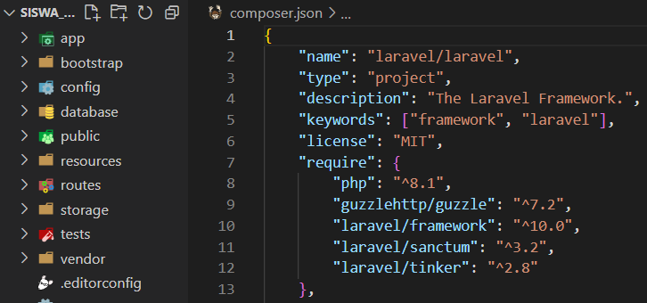
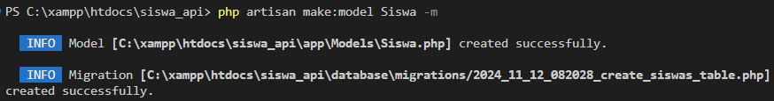
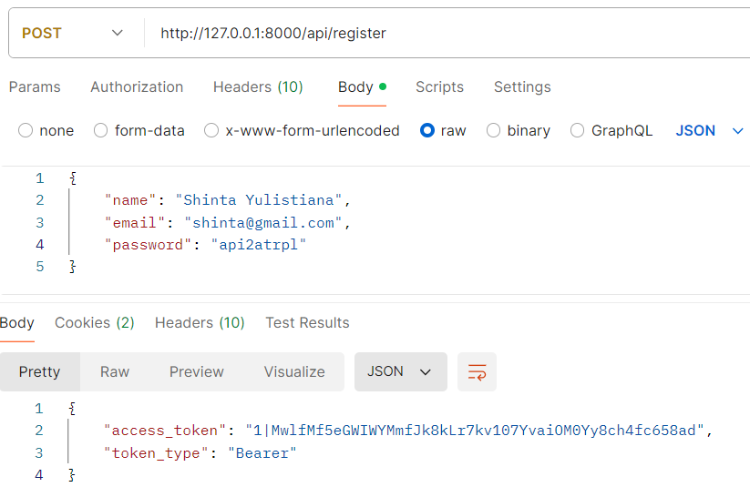

Langkah 1: Persiapan Lingkungan

1. 
2. 

Langkah 2: Instalasi dan Konfigurasi Laravel Sanctum

1. 
2. 
3. 
4. 
5. 

Langkah 3: Autentikasi API

1. 
   
2. 

Langkah 4: CRUD Data Siswa

1. 
   
   
2. 
   
   

Langkah 5: Debugging dan Logging

1. 
2. 
3. 
   

Langkah 6: Pengujian API

1. Pengujian dengan Postman:
    - Uji endpoint registrasi, login, dan CRUD siswa menggunakan Postman.
    - Pastikan untuk menyertakan token pada header Authorization untuk endpoint yang memerlukan autentikasi.
      
      
